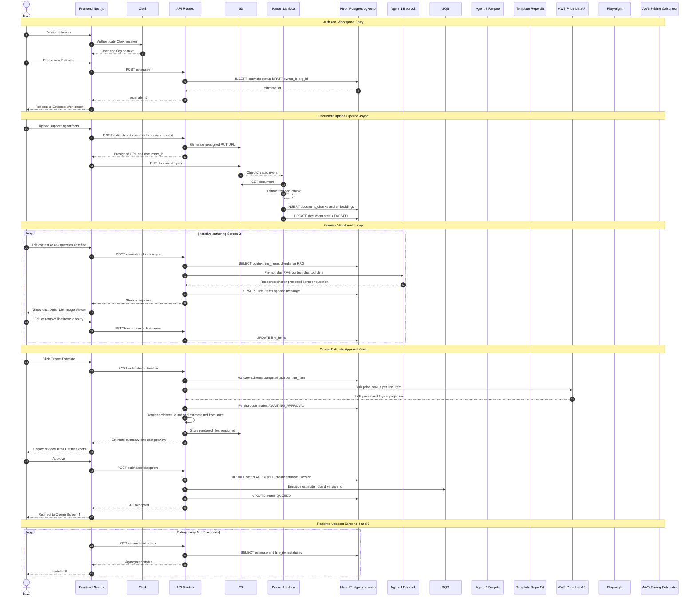
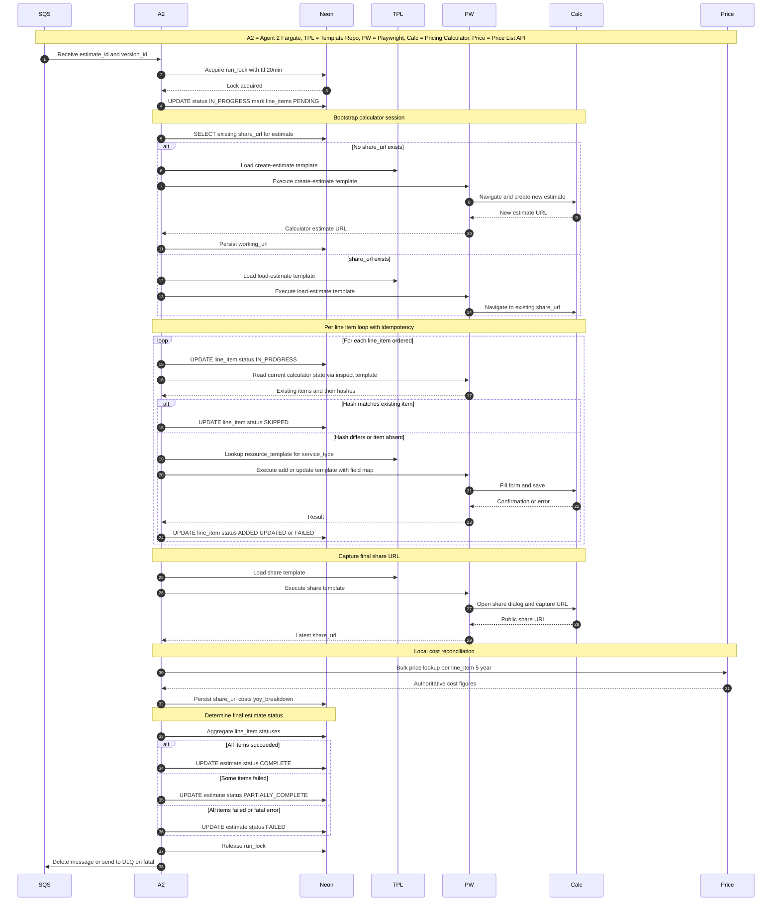
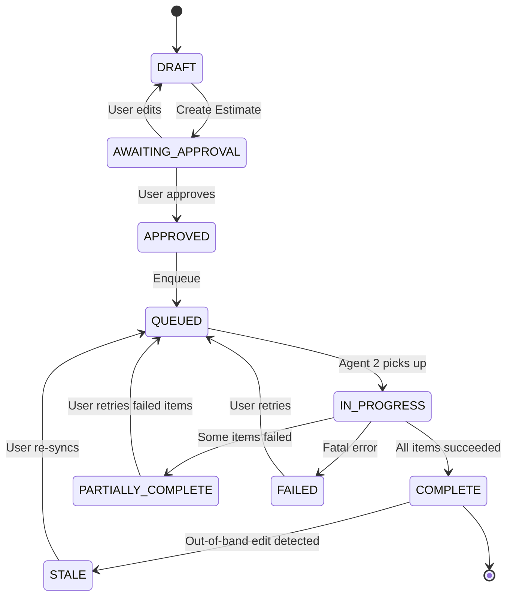
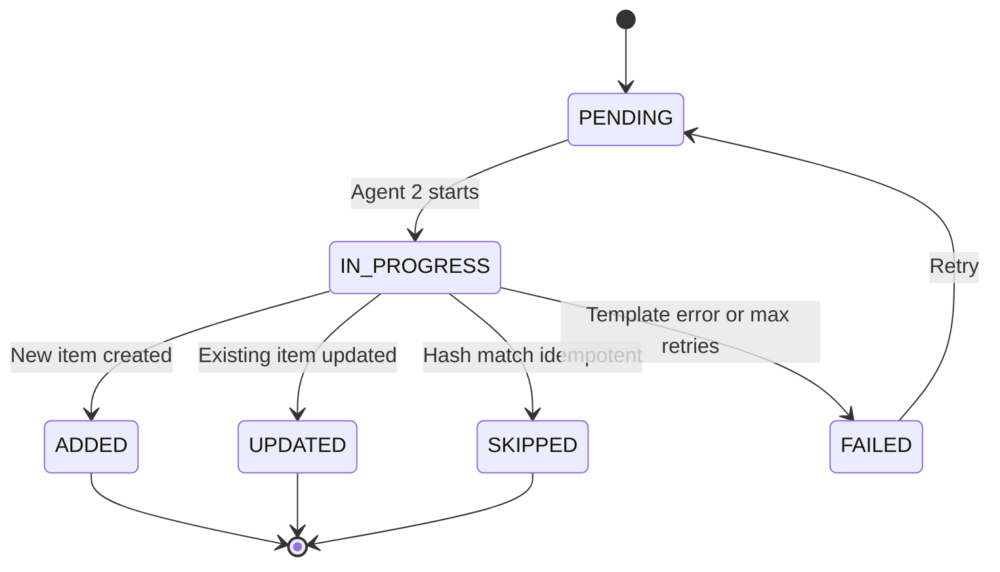

# Recommended Sequence Flow

This sequence diagram incorporates the trade-off recommendations captured in `SA-first-pass.md`. It supersedes the original whiteboard flow and reflects:

- Hybrid contract (structured payload + rendered Markdown)
- Neon (Postgres) + S3 + pgvector instead of DynamoDB
- Editable Detail List with structured state living in DB before approval
- Two-layer status model (estimate + per-line-item)
- Fargate-hosted Agent 2 with declarative templates and per-item idempotency
- Local cost compute via Price List API alongside Pricing Calculator population
- Polling-based realtime updates for Screens 4 and 5

---

## Primary Sequence: Estimate Authoring → Calculator Population

---

## Agent 2 Detail: Calculator Population

---

## Status State Machine

---

## Per-Line-Item State Machine

---

## Component Responsibilities (Quick Reference)

| Component | Responsibility |
|---|---|
| **Frontend (Next.js)** | Auth context, Estimate Workbench UI, polling, file uploads via presigned URLs |
| **API Routes** | Auth checks, Drizzle queries, Bedrock invocation for Agent 1, queue dispatch, render projections |
| **Neon (Postgres)** | Source of truth for estimates, line items, versions, statuses, document metadata, embeddings (pgvector) |
| **S3** | Document blob storage + rendered output files (architecture.md, estimate.md) |
| **Parser Lambda** | Document text extraction, chunking, embedding generation |
| **Agent 1 (Bedrock)** | Conversational reasoning, line-item proposal, RAG over user docs |
| **SQS** | Decouples approval from Agent 2 execution; DLQ for poison messages |
| **Agent 2 (Fargate)** | Orchestrates Playwright session, executes templates, reconciles state |
| **Template Repo (Git)** | Declarative templates per Pricing Calculator screen, baked into Fargate image |
| **AWS Price List API** | Authoritative cost computation for YoY chart |
| **AWS Pricing Calculator** | External UI, populated via Playwright, source of share URLs |

---

## Mapping to Storyboard Screens

| Screen | Flow Coverage |
|---|---|
| **1. Sign-in** | Clerk auth step (top of primary sequence) |
| **2. Index + Upload** | Document upload pipeline, S3 + Parser Lambda |
| **3. Estimate Workbench** | Iterative authoring loop with Agent 1 + Detail List edits |
| **4. Queue** | Polling loop + estimate-level state machine |
| **5. Output / Version Control** | Per-version share URL + YoY costs from Price List API |

---

## What's Different from the Original Diagram

1. **Detail List edits flow into Neon directly** — no longer waits for "Create Estimate" to materialize structured data.
2. **Output files are projections, not primary artifacts** — `architecture.md` and `estimate.md` are rendered from Neon on demand and stored as versioned artifacts in S3.
3. **Agent 2 reads existing calculator state before mutating** — supports idempotency and update-vs-create flow without LLM-side branching.
4. **Cost figures come from Price List API, not the calculator** — decouples Screen 5's chart from Playwright reliability.
5. **Two-layer status (estimate + line item)** — supports targeted retry and meaningful failure messages.
6. **Document parsing is async out-of-band** — uploads don't block the user.
7. **Templates are baked into the Fargate image from Git** — versioned as code, reviewable in PRs, tested in CI.

---

# Next Step

Once trade-offs are confirmed in `SA-first-pass.md`, the recommended first spec is **Estimate Format & Contract** since it locks the schema both halves consume.
