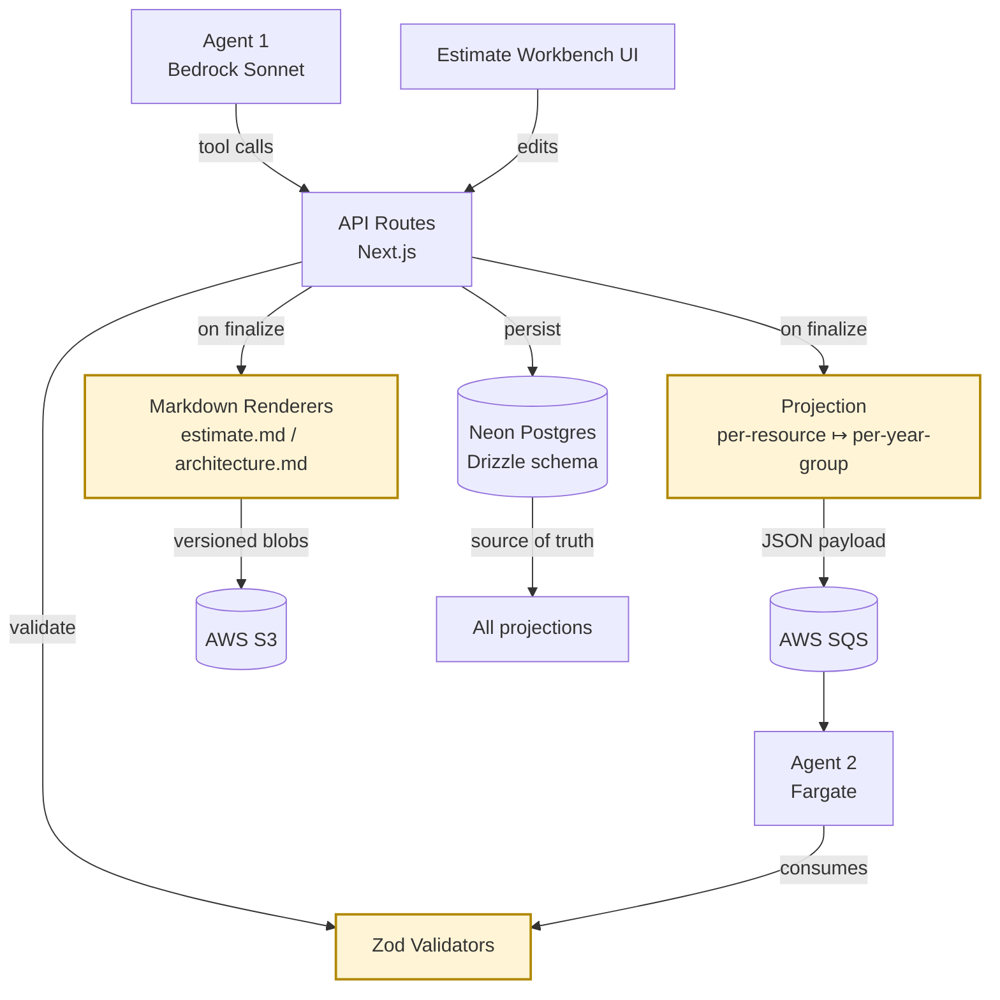
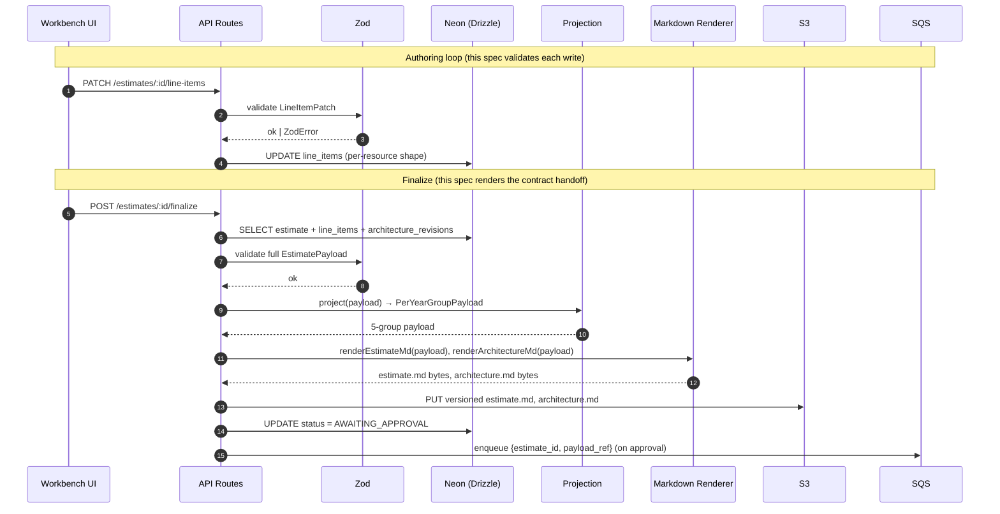
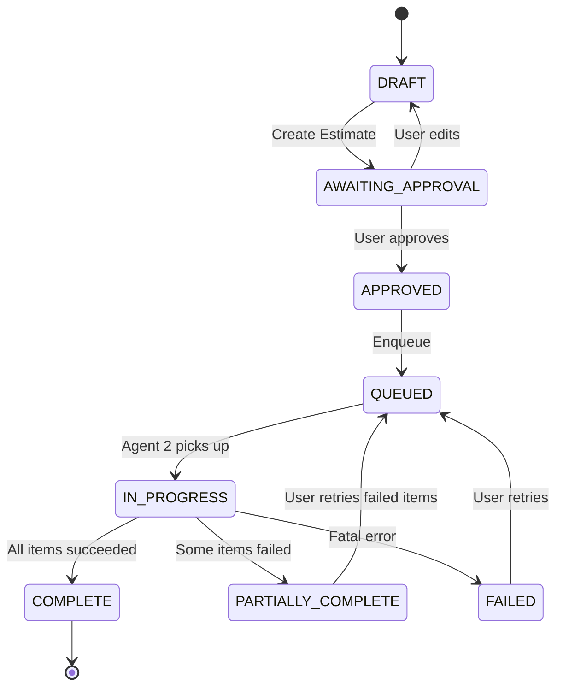

# Design Document: Estimate Format & Contract

## Overview

This spec defines the **structured payload that flows from Agent 1 to Agent 2**, plus the **Markdown projections** rendered from that payload for human review and as one of the two output files Screen 3 produces (`estimate.md` alongside `architecture.md`). It is the contract that locks the seam between the conversational authoring half (Agent 1, Estimate Workbench) and the deterministic execution half (Agent 2, Pricing Calculator automation).

The contract has three concrete forms of the same logical estimate:

1. **Persisted form** in Neon — relational rows across `estimates`, `line_items`, `share_url_revisions`, `architecture_revisions`, and `estimate_audit_log`. Per-resource shape with a five-element `quantity_per_year` array (per D-07.6).
2. **Wire form** consumed by Agent 2 — a JSON payload validated by Zod, reshaped by a deterministic projection into per-year groups (five groups, one per year, per D-07).
3. **Human projection** — `estimate.md` and `architecture.md`, rendered deterministically from the persisted form and stored as versioned artifacts in S3 (Neon remains source of truth).

Subsequent specs (Estimate Authoring Workbench, Pricing Calculator Automation, etc.) consume this contract. Without it, both halves of the system are paralyzed — which is the criterion that justifies treating this spec as a Horizontal Foundation per `spec-decomposition-rules.md`.

## Spec Shape Declaration

**Shape:** Horizontal Foundation (per Rule 3 of `spec-decomposition-rules.md`).

**Justification:** This spec produces no user-facing UI. It produces schema files, validators, projection functions, and renderers consumed by every downstream spec. The Workbench cannot persist line items without these tables; Agent 2 cannot consume Agent 1's output without these validators; Screen 3's "Create Estimate" output cannot be rendered without these projections. A foundation shape is appropriate, and per Rule 3 it must include a runnable test harness in its task list — which it does (see Testing Strategy).

## Architecture



The yellow boxes (`Zod Validators`, `Projection`, `Markdown Renderers`) plus the Drizzle schema files are the deliverables of this spec. Everything else is consumer or infrastructure already locked elsewhere.

## Sequence Diagram: Where This Contract Operates



## Components and Interfaces

### Component 1: Drizzle Schema Module

**Purpose:** Single source of truth for table definitions. Imported by API routes, the projection function, the renderer, and the test harness. Generates migrations via `drizzle-kit`.

**Interface (TypeScript):**

```typescript
// src/db/schema/estimates.ts (and siblings)
export const estimates = pgTable('estimates', { /* ... */ })
export const lineItems = pgTable('line_items', { /* ... */ })
export const shareUrlRevisions = pgTable('share_url_revisions', { /* ... */ })
export const architectureRevisions = pgTable('architecture_revisions', { /* ... */ })
export const estimateAuditLog = pgTable('estimate_audit_log', { /* ... */ })

// Inferred types for application code
export type Estimate = InferSelectModel<typeof estimates>
export type LineItem = InferSelectModel<typeof lineItems>
// ...etc.
```

**Responsibilities:**
- Define column types, constraints, and indexes (including the partial unique index on `share_url_revisions(estimate_id) WHERE is_first_pass = true`).
- Export inferred row types for use by validators and projections.
- Enumerate status types as Postgres enums (`estimate_status`, `line_item_status`, `audit_action_type`).

### Component 2: Zod Validators

**Purpose:** Runtime validation at every trust boundary — incoming HTTP payloads, outgoing wire payloads to Agent 2, and round-trip checks in the harness.

**Interface:**

```typescript
// src/contract/schema.ts
export const EstimatePayloadSchema: z.ZodSchema<EstimatePayload>
export const LineItemSchema: z.ZodSchema<LineItem>
export const PerYearGroupPayloadSchema: z.ZodSchema<PerYearGroupPayload>
export const ShareUrlRevisionSchema: z.ZodSchema<ShareUrlRevision>

// Convenience parsers
export function parseEstimatePayload(input: unknown): EstimatePayload
export function safeParseEstimatePayload(input: unknown): SafeParseReturnType
```

**Responsibilities:**
- Express every invariant that can be checked from a single payload (length-5 quantity arrays, non-negative integers, region = `us-east-1`, status enum membership, etc.).
- Refuse payloads that violate schema-level invariants.
- Be consumed both by the API on inbound writes and by the test harness on round-trip.

### Component 3: Projection Function

**Purpose:** Pure function that reshapes the per-resource year-array form into the per-year-group form Agent 2 consumes. **Not persisted** — projections are computed on demand.

**Interface:**

```typescript
// src/contract/projection.ts
export function projectToPerYearGroups(
  payload: EstimatePayload
): PerYearGroupPayload
```

**Responsibilities:**
- Group line items by year (Year 1 through Year 5).
- Drop `quantity_per_year` arrays in favor of a single `quantity` field per group entry.
- Carry forward the constant configuration for each line item into every year group it appears in.
- Compute year-start labels using the estimate's `year_one_start_month`.

### Component 4: Markdown Renderers

**Purpose:** Deterministic projection from the persisted payload to two human-readable Markdown documents.

**Interface:**

```typescript
// src/contract/markdown.ts
export function renderEstimateMd(payload: EstimatePayload): string
export function renderArchitectureMd(
  payload: EstimatePayload,
  architectureRevision: ArchitectureRevision
): string
```

**Responsibilities:**
- Produce byte-identical output for byte-identical inputs (modulo a documented metadata block).
- Total: no validated payload causes the renderer to throw.
- `estimate.md`: Resources × Configurations × Quantities organized year-by-year, plus a Narrative section.
- `architecture.md`: wraps the pinned Mermaid revision with Agent 1's commentary.

### Component 5: Test Harness

**Purpose:** Runnable demonstration that the contract holds end-to-end. Required by Foundation shape (Rule 3).

**Interface:**

```bash
pnpm contract:harness               # runs all checks against fixtures
pnpm contract:harness --pbt-only    # property-based tests only
pnpm contract:harness --fixture sample-estimate.json
```

**Responsibilities:**
- Load sample estimate fixtures.
- Run them through validators, projection, and renderer.
- Emit projected JSON, projected Markdown, and a PBT report.
- Exit non-zero on any failure.

## Data Models

### Postgres Enums

```typescript
export const estimateStatus = pgEnum('estimate_status', [
  'DRAFT',
  'AWAITING_APPROVAL',
  'APPROVED',
  'QUEUED',
  'IN_PROGRESS',
  'COMPLETE',
  'PARTIALLY_COMPLETE',
  'FAILED',
]) // No STALE per D-11 v1

export const lineItemStatus = pgEnum('line_item_status', [
  'PENDING',
  'IN_PROGRESS',
  'ADDED',
  'FAILED',
]) // No SKIPPED, UPDATED per D-11 v1

export const auditActionType = pgEnum('audit_action_type', [
  'VIEWED', 'CONTEXT_EDITED',
  'DOCUMENT_UPLOADED', 'DOCUMENT_DELETED',
  'APPROVED', 'RUN_STARTED', 'RUN_COMPLETED', 'RUN_FAILED',
  'SHARE_URL_ADDED', 'SHARE_URL_DELETED',
  'NAME_EDITED', 'TEAM_MEMBER_INVITED', 'TEAM_MEMBER_REMOVED',
]) // Per D-30.3
```

### Table: `estimates`

```typescript
export const estimates = pgTable('estimates', {
  id: uuid('id').primaryKey().defaultRandom(),
  ownerId: text('owner_id').notNull(),                       // Clerk user id (D-04)
  orgId: text('org_id'),                                     // Clerk org id, nullable for personal estimates
  name: text('name').notNull().default('Untitled Estimate'), // D-29 user-supplied, editable
  status: estimateStatus('status').notNull().default('DRAFT'),
  yearOneStartMonth: date('year_one_start_month').notNull(), // D-07.4 Year 1 anchor (first-of-month)
  pinnedArchitectureRevisionId: uuid('pinned_architecture_revision_id')
    .references(() => architectureRevisions.id),             // Set at finalize (D-06.3)
  runLockHolder: text('run_lock_holder'),                    // For Agent 2 lock per D-10
  runLockExpiresAt: timestamp('run_lock_expires_at'),
  createdAt: timestamp('created_at').notNull().defaultNow(),
  updatedAt: timestamp('updated_at').notNull().defaultNow(),
  deletedAt: timestamp('deleted_at'),                        // Soft delete per D-32
}, (t) => ({
  ownerIdx: index('estimates_owner_idx').on(t.ownerId),
  orgIdx: index('estimates_org_idx').on(t.orgId),
  statusIdx: index('estimates_status_idx').on(t.status),
}))
```

**Validation Rules:**
- `name`: non-null string; uniqueness not enforced (per D-29).
- `status`: must be one of the v1 estimate states; transitions enforced by application logic, not DB.
- `yearOneStartMonth`: first day of a month (validation expressed in Zod, not in DB).
- `ownerId` is required; `orgId` may be null (personal estimate per D-04).

### Table: `line_items`

```typescript
export const lineItems = pgTable('line_items', {
  id: uuid('id').primaryKey().defaultRandom(),
  estimateId: uuid('estimate_id').notNull()
    .references(() => estimates.id, { onDelete: 'cascade' }),
  serviceCode: text('service_code').notNull(),               // e.g., 'ec2', 's3'
  configuration: jsonb('configuration').$type<Configuration>().notNull(),
  region: text('region').notNull().default('us-east-1'),     // D-07.5 / D-33
  quantityPerYear: jsonb('quantity_per_year')
    .$type<[number, number, number, number, number]>().notNull(),
  status: lineItemStatus('status').notNull().default('PENDING'),
  failureReason: text('failure_reason'),                     // populated when status = FAILED
  createdAt: timestamp('created_at').notNull().defaultNow(),
  updatedAt: timestamp('updated_at').notNull().defaultNow(),
}, (t) => ({
  estimateIdx: index('line_items_estimate_idx').on(t.estimateId),
  // Region constraint enforced via CHECK constraint expressed in migration:
  //   CHECK (region = 'us-east-1')  -- v1 ground rule per D-07.5
}))
```

**Configuration shape (jsonb, per service):**
```typescript
type Configuration = {
  // service-specific keys; constant across the five years per D-07.6
  // Examples:
  //   ec2:    { instanceType: 't3.medium', vCpu: 2, memoryGib: 4 }
  //   s3:     { storageClass: 'STANDARD', storageGib: 100 }
  //   rds:    { engine: 'postgres', instanceClass: 'db.t3.medium', storageGib: 50 }
  [key: string]: JsonValue
}
```

**Validation Rules (Zod-enforced, see Component 2):**
- `quantityPerYear` is exactly five non-negative integers.
- `configuration` is a JSON object (not array, not primitive).
- `region` equals `'us-east-1'` (v1 ground rule per D-07.5).
- `serviceCode` matches the service vocabulary (initial set from D-08: ec2, s3, rds, lambda, dynamodb, cloudfront).

### Table: `architecture_revisions`

```typescript
export const architectureRevisions = pgTable('architecture_revisions', {
  id: uuid('id').primaryKey().defaultRandom(),
  estimateId: uuid('estimate_id').notNull()
    .references(() => estimates.id, { onDelete: 'cascade' }),
  mermaidSource: text('mermaid_source').notNull(),           // D-06.1 Mermaid format for v1
  agentCommentary: text('agent_commentary'),                 // Agent 1's prose annotations
  generationReason: text('generation_reason').notNull(),     // why this revision was generated
  promptMetadata: jsonb('prompt_metadata').$type<PromptMeta>(),
  createdAt: timestamp('created_at').notNull().defaultNow(),
}, (t) => ({
  estimateIdx: index('arch_revisions_estimate_idx').on(t.estimateId),
}))
```

**Validation Rules:**
- `mermaidSource`: non-empty string; basic Mermaid sanity check (starts with a recognized diagram declaration).
- Revisions are append-only; the estimate `pinnedArchitectureRevisionId` references the row that was current at finalize time.

### Table: `share_url_revisions`

```typescript
export const shareUrlRevisions = pgTable('share_url_revisions', {
  id: uuid('id').primaryKey().defaultRandom(),
  estimateId: uuid('estimate_id').notNull()
    .references(() => estimates.id, { onDelete: 'cascade' }),
  shareUrl: text('share_url').notNull(),
  isFirstPass: boolean('is_first_pass').notNull().default(false), // D-22
  createdBy: text('created_by').notNull(),                   // Clerk user id
  note: text('note'),                                        // user-supplied
  createdAt: timestamp('created_at').notNull().defaultNow(),
  deletedAt: timestamp('deleted_at'),                        // soft delete
}, (t) => ({
  estimateIdx: index('share_revisions_estimate_idx').on(t.estimateId),
  // Partial unique index enforces "exactly one is_first_pass = true per estimate":
  firstPassUnique: uniqueIndex('share_revisions_first_pass_unique')
    .on(t.estimateId)
    .where(sql`${t.isFirstPass} = true AND ${t.deletedAt} IS NULL`),
}))
```

**Validation Rules:**
- `shareUrl`: well-formed URL pointing to `calculator.aws/#/estimate?id=...` (regex check in Zod).
- `isFirstPass`: at most one `true` row per estimate (DB-enforced); set by Agent 2 on first successful run; never edited.
- Soft delete via `deletedAt`; partial index excludes deleted rows so a soft-deleted first-pass row does not block a re-run (this scenario is out of scope for v1 but the schema is correct for the future).

### Table: `estimate_audit_log`

```typescript
export const estimateAuditLog = pgTable('estimate_audit_log', {
  id: uuid('id').primaryKey().defaultRandom(),
  estimateId: uuid('estimate_id').notNull()
    .references(() => estimates.id, { onDelete: 'cascade' }),
  userId: text('user_id').notNull(),                         // Clerk user id
  actionType: auditActionType('action_type').notNull(),
  details: jsonb('details').$type<AuditDetails>(),
  createdAt: timestamp('created_at').notNull().defaultNow(),
}, (t) => ({
  estimateIdx: index('audit_estimate_idx').on(t.estimateId),
  actionIdx: index('audit_action_idx').on(t.actionType),
  createdIdx: index('audit_created_idx').on(t.createdAt),
}))
```

Append-only: no updates, no hard deletes (per D-30.3). Enforced at the application layer; physical DB enforcement via `REVOKE UPDATE, DELETE` in a follow-up infra task.

### Wire payload (Zod-typed)

```typescript
export type EstimatePayload = {
  id: string                              // uuid
  ownerId: string
  orgId: string | null
  name: string
  status: EstimateStatus
  yearOneStartMonth: string               // ISO 'YYYY-MM-01'
  pinnedArchitectureRevisionId: string | null
  lineItems: LineItem[]
  createdAt: string                       // ISO timestamp
  updatedAt: string
}

export type LineItem = {
  id: string
  serviceCode: string
  configuration: Configuration            // constant across 5 years
  region: 'us-east-1'                     // literal type
  quantityPerYear: [number, number, number, number, number]
  status: LineItemStatus
  failureReason: string | null
}

export type PerYearGroupPayload = {
  estimateId: string
  yearOneStartMonth: string
  groups: [YearGroup, YearGroup, YearGroup, YearGroup, YearGroup]
}

export type YearGroup = {
  yearIndex: 1 | 2 | 3 | 4 | 5
  startMonth: string                      // ISO 'YYYY-MM-01'
  items: YearGroupItem[]                  // empty if no line items have qty in this year
}

export type YearGroupItem = {
  lineItemId: string
  serviceCode: string
  configuration: Configuration
  region: 'us-east-1'
  quantity: number                        // non-negative int (the quantity for this year)
}
```


## Algorithmic Pseudocode

### Algorithm 1: Project Per-Resource Payload to Per-Year Groups

```pascal
ALGORITHM projectToPerYearGroups(payload)
INPUT: payload of type EstimatePayload
OUTPUT: result of type PerYearGroupPayload

BEGIN
  ASSERT validateEstimatePayload(payload) = true

  // Step 1: Compute year-start months from the estimate anchor
  groups ← []
  FOR yearIndex IN [1, 2, 3, 4, 5] DO
    startMonth ← addMonths(payload.yearOneStartMonth, (yearIndex - 1) * 12)
    groups[yearIndex - 1] ← { yearIndex, startMonth, items: [] }
  END FOR

  // Step 2: Distribute each line item into the year groups where its quantity > 0
  FOR each item IN payload.lineItems DO
    ASSERT item.quantityPerYear.length = 5
    ASSERT all(q ≥ 0 AND isInteger(q) FOR q IN item.quantityPerYear)

    FOR yearIndex IN [1, 2, 3, 4, 5] DO
      qty ← item.quantityPerYear[yearIndex - 1]
      IF qty > 0 THEN
        groups[yearIndex - 1].items.append({
          lineItemId: item.id,
          serviceCode: item.serviceCode,
          configuration: item.configuration,  // constant across years per D-07.6
          region: item.region,
          quantity: qty,
        })
      END IF
    END FOR
  END FOR

  // Step 3: Stable ordering — sort items within each group by lineItemId for determinism
  FOR each group IN groups DO
    sort group.items by lineItemId ASCENDING
  END FOR

  result ← {
    estimateId: payload.id,
    yearOneStartMonth: payload.yearOneStartMonth,
    groups: groups,
  }

  ASSERT result.groups.length = 5
  RETURN result
END
```

**Preconditions:**
- `payload` passes Zod validation (`EstimatePayloadSchema`).
- `payload.yearOneStartMonth` is the first day of a month.
- For every line item, `quantityPerYear` has exactly five non-negative integers.

**Postconditions:**
- Output has exactly 5 groups, indexed Year 1 through Year 5.
- Each group's `startMonth` equals `payload.yearOneStartMonth + (yearIndex − 1) × 12 months`.
- `quantity = 0` items are omitted from groups (rendering and Agent 2 don't need them).
- Within a group, items are sorted by `lineItemId` for deterministic output (stability invariant).
- Configuration objects in the output are deep-equal to the input configurations (no mutation).

**Loop Invariants:**
- Outer loop (line items): groups[0..4] always contain only items whose quantity for that year is > 0.
- Inner loop (year index): item appears in `groups[k]` if and only if `item.quantityPerYear[k] > 0`.

### Algorithm 2: Render `estimate.md`

```pascal
ALGORITHM renderEstimateMd(payload)
INPUT: payload of type EstimatePayload (validated)
OUTPUT: markdown of type String

BEGIN
  ASSERT validateEstimatePayload(payload) = true

  buf ← StringBuilder()

  // Section 1: Header (deterministic, no timestamps inline; metadata block at bottom)
  buf.append("# ", payload.name, "\n\n")
  buf.append("**Estimate ID:** ", payload.id, "\n")
  buf.append("**Status:** ", payload.status, "\n")
  buf.append("**Region:** us-east-1\n")
  buf.append("**Year 1 starts:** ", formatYearMonth(payload.yearOneStartMonth), "\n\n")

  // Section 2: Per-year resources (use the projection so layout matches Agent 2's view)
  perYear ← projectToPerYearGroups(payload)
  FOR each group IN perYear.groups DO
    buf.append("## Year ", group.yearIndex, " — starting ", formatYearMonth(group.startMonth), "\n\n")
    IF group.items IS empty THEN
      buf.append("_No resources in this year._\n\n")
    ELSE
      buf.append("| Service | Configuration | Quantity |\n")
      buf.append("|---------|---------------|----------|\n")
      FOR each item IN group.items DO
        buf.append("| ", item.serviceCode, " | ", formatConfig(item.configuration), " | ", item.quantity, " |\n")
      END FOR
      buf.append("\n")
    END IF
  END FOR

  // Section 3: Narrative — pulled from the estimate (added by Agent 1)
  buf.append("## Narrative\n\n")
  buf.append(payload.narrative OR "_No narrative provided._", "\n")

  // Section 4: Metadata block (the ONE place renderer-time data appears, fenced)
  buf.append("\n<!-- contract-metadata\n")
  buf.append("schemaVersion: ", CONTRACT_SCHEMA_VERSION, "\n")
  buf.append("rendererVersion: ", RENDERER_VERSION, "\n")
  buf.append("-->\n")

  RETURN buf.toString()
END
```

**Preconditions:**
- `payload` is a validated `EstimatePayload`.
- `formatConfig` is a deterministic JSON canonicalizer (sorted keys, stable separators).

**Postconditions:**
- Output is a string of valid UTF-8 Markdown.
- Function never throws on validated input (totality).
- For two byte-identical payloads with equal `CONTRACT_SCHEMA_VERSION` and `RENDERER_VERSION`, output is byte-identical (determinism).
- Metadata block is the only renderer-time content; the rest is pure projection of the payload.

**Loop Invariants:**
- After processing year `k`, `buf` contains exactly the Year-1 through Year-`k` sections plus the header.

### Algorithm 3: Render `architecture.md`

```pascal
ALGORITHM renderArchitectureMd(payload, archRevision)
INPUT:
  payload of type EstimatePayload
  archRevision of type ArchitectureRevision (must match payload.pinnedArchitectureRevisionId)
OUTPUT: markdown of type String

BEGIN
  ASSERT archRevision.id = payload.pinnedArchitectureRevisionId

  buf ← StringBuilder()
  buf.append("# Architecture: ", payload.name, "\n\n")
  buf.append("```mermaid\n", archRevision.mermaidSource, "\n```\n\n")

  IF archRevision.agentCommentary IS NOT empty THEN
    buf.append("## Commentary\n\n", archRevision.agentCommentary, "\n\n")
  END IF

  buf.append("<!-- contract-metadata\n")
  buf.append("schemaVersion: ", CONTRACT_SCHEMA_VERSION, "\n")
  buf.append("rendererVersion: ", RENDERER_VERSION, "\n")
  buf.append("architectureRevisionId: ", archRevision.id, "\n")
  buf.append("-->\n")

  RETURN buf.toString()
END
```

**Preconditions:**
- `archRevision.id = payload.pinnedArchitectureRevisionId` (renderer asserts).
- `archRevision.mermaidSource` is non-empty.

**Postconditions:**
- Total: returns a string for any valid pair.
- Deterministic: same inputs ⇒ same bytes (modulo metadata block).

## Key Functions with Formal Specifications

### `parseEstimatePayload(input: unknown): EstimatePayload`

```typescript
function parseEstimatePayload(input: unknown): EstimatePayload
```

**Preconditions:** `input` is any JS value (untrusted).
**Postconditions:** Returns an `EstimatePayload` if and only if `input` satisfies `EstimatePayloadSchema`. Otherwise throws `ZodError` listing every violation. Output object is a fresh deep clone (no aliasing with `input`).

### `projectToPerYearGroups(payload: EstimatePayload): PerYearGroupPayload`

**Preconditions:** `payload` is the result of `parseEstimatePayload` (or otherwise validated).
**Postconditions:** Returns a `PerYearGroupPayload` with exactly 5 groups; pure function (no side effects, no input mutation); `Σ over groups Σ over items quantity = Σ over lineItems Σ q in quantityPerYear (q where q > 0)`.

### `renderEstimateMd(payload: EstimatePayload): string`

**Preconditions:** `payload` is validated.
**Postconditions:** Total (never throws). Deterministic up to renderer/schema version pinned in metadata block.

### `renderArchitectureMd(payload, archRev): string`

**Preconditions:** `payload.pinnedArchitectureRevisionId === archRev.id` and `archRev.mermaidSource` non-empty.
**Postconditions:** Total (never throws). Deterministic up to renderer/schema version metadata.

### `roundTrip(payload: EstimatePayload): EstimatePayload`

```typescript
function roundTrip(payload: EstimatePayload): EstimatePayload {
  return parseEstimatePayload(JSON.parse(JSON.stringify(payload)))
}
```

**Preconditions:** `payload` validates.
**Postconditions:** `roundTrip(p)` deep-equals `p` for every validated `p` (round-trip invariant).

## Example Usage

```typescript
import {
  parseEstimatePayload,
  projectToPerYearGroups,
  renderEstimateMd,
  renderArchitectureMd,
} from '@/contract'

// 1. Validate an inbound payload (e.g., from Agent 1's tool call)
const payload = parseEstimatePayload(request.body)

// 2. Project for Agent 2 consumption
const perYear = projectToPerYearGroups(payload)
await sqs.send({ estimateId: payload.id, perYear })

// 3. Render human projections at finalize time
const archRev = await db.query.architectureRevisions.findFirst({
  where: eq(architectureRevisions.id, payload.pinnedArchitectureRevisionId!),
})
const estimateMd = renderEstimateMd(payload)
const architectureMd = renderArchitectureMd(payload, archRev!)

await s3.put(`estimates/${payload.id}/v${version}/estimate.md`, estimateMd)
await s3.put(`estimates/${payload.id}/v${version}/architecture.md`, architectureMd)
```

## Correctness Properties (Invariants)

This section enumerates every invariant the contract maintains and how each is enforced. Per Rule 6 of `spec-decomposition-rules.md`, PBT-mandated invariants get a property-based test entry in the task list. Soft deferrals are allowed for early specs with documented rationale.

| # | Invariant | Enforcement | PBT? |
|---|-----------|-------------|------|
| I-1 | Every estimate has at most one `is_first_pass = true` row in `share_url_revisions` (active rows). | DB partial unique index + Zod check in harness | **PBT** |
| I-2 | Every line item has a `quantityPerYear` array of exactly 5 non-negative integers. | Zod tuple-of-5-non-neg-ints | **PBT** |
| I-3 | Configuration is constant across years for a given line item. | True by construction (single `configuration` field). PBT verifies projection preserves it across all 5 year groups. | **PBT** |
| I-4 | Region equals `'us-east-1'` for every line item in v1. | Zod literal `'us-east-1'` + DB CHECK constraint | **PBT** (trivial; included for completeness) |
| I-5 | Markdown projection is deterministic: same payload + same renderer version → same Markdown bytes. | Renderer is pure. PBT generates payloads, renders twice, asserts equality. | **PBT** |
| I-6 | Markdown projection is total: no validated payload causes the renderer to throw. | Total function. PBT generates valid payloads, asserts no throw. | **PBT** |
| I-7 | Round-trip: `parse(JSON.stringify(p)) deep-equals p` for every validated `p`. | Pure JSON-safe types. PBT round-trips. | **PBT** |
| I-8 | Status transitions follow the v1 estimate state machine. | State machine module + PBT over random transition sequences. | **PBT** |
| I-9 | Projection sum invariant: total quantity across all per-year-groups equals sum of `quantityPerYear` arrays across all line items (for entries where qty > 0). | Pure projection logic; PBT compares sums. | **PBT** |
| I-10 | Year-start months are exactly 12 calendar months apart, anchored at `yearOneStartMonth`. | Pure arithmetic; PBT randomizes the anchor. | **PBT** |
| I-11 | Audit log is append-only at the application layer (no UPDATE / DELETE paths). | Code review + integration test in harness; PBT not applicable (structural, not value-based). | Deferred (rationale: structural; tested by attempting and asserting no API surface allows mutation). |
| I-12 | `pinnedArchitectureRevisionId` is non-null when `status` ∈ {AWAITING_APPROVAL, APPROVED, QUEUED, IN_PROGRESS, COMPLETE, PARTIALLY_COMPLETE, FAILED}. | Zod cross-field refinement; PBT over random status + pinned-id pairs. | **PBT** |

**PBT framework:** `fast-check` v3.x — pinned, mature TypeScript-native PBT library; integrates cleanly with Vitest. AWS-native equivalent does not exist for property-based testing (developer tooling area where the AWS-first preference is lighter per `aws-first-preference.md`).

## Status State Machine (v1)

Reproduced from D-11 v1 for reference; the state machine module is part of this spec's deliverables.



No `STALE` per D-11 v1 ground rules.

## Error Handling

### Scenario 1: Invalid Inbound Payload

**Condition:** Agent 1 (or the UI) sends a payload that fails Zod validation.
**Response:** API returns `400` with the Zod error tree serialized. No DB writes.
**Recovery:** Caller corrects payload. No state to clean up.

### Scenario 2: Projection Receives Validated Payload That Violates Stronger Invariant

**Condition:** Should be impossible (Zod is the gate). If it happens, treat as a contract bug.
**Response:** Throw `ContractInvariantError` with the failing invariant id (I-3 etc.). Surfaces as `500` to the caller; emits a CloudWatch metric `contract.invariant_violation` per D-19.
**Recovery:** Bug fix. Harness PBTs should catch this before deploy.

### Scenario 3: Renderer Encounters Unexpected Configuration Shape

**Condition:** `configuration` jsonb contains a value the formatter doesn't know how to render (e.g., a function — impossible from JSON, but defensively).
**Response:** Renderer falls back to `JSON.stringify` with sorted keys. Never throws (totality, I-6).
**Recovery:** None needed; output is still deterministic.

### Scenario 4: Architecture Revision Mismatch

**Condition:** Caller passes an `archRevision` whose `id` does not match `payload.pinnedArchitectureRevisionId`.
**Response:** `renderArchitectureMd` throws `ContractInvariantError`. This is a programming bug, not a user error.
**Recovery:** Fix at call site.

### Scenario 5: Soft-Deleted First-Pass Share URL With New First-Pass Insert

**Condition:** Out of scope for v1 (only one Agent 2 run per estimate per D-13). Schema permits a future re-run by virtue of the partial unique index excluding `deleted_at IS NULL` rows. Behavior is documented but not exercised in v1.

## Testing Strategy

### Unit Testing Approach

- Zod schemas: feed positive and negative fixtures; assert pass/fail.
- Projection: snapshot tests against fixture estimates; assert sum invariants.
- Renderers: snapshot tests of rendered Markdown for canonical fixtures.
- State machine: enumerate every legal transition; enumerate every illegal transition.

Test framework: **Vitest** v1.x (pinned). Pure unit-tests-pass is not the demonstration (Rule 2); see Demo Script.

### Property-Based Testing Approach

**Library:** `fast-check` v3.x (pinned).

**Generators (`Arbitrary`s) provided by the harness:**
- `arbConfig` — random JSON object with bounded depth/keys.
- `arbLineItem` — random service code, configuration, region (always `us-east-1`), quantity-per-year tuple.
- `arbEstimatePayload` — composes the above with random IDs, names, anchor months.
- `arbStatusTransition` — biased toward legal transitions, with random illegal injections.

**Properties:** one per PBT-marked row in the invariants table.

**Reproducibility:** every property run uses a deterministic seed printed on failure, so failures are debuggable from CI logs.

### Integration Testing (Harness)

The harness is a TypeScript script (`scripts/contract-harness.ts`) that:
1. Loads fixtures from `fixtures/sample-estimates/`.
2. Runs each fixture through `parseEstimatePayload` (Zod).
3. Runs each parsed payload through `projectToPerYearGroups`.
4. Runs each parsed payload through `renderEstimateMd` and `renderArchitectureMd`.
5. Writes the projection JSON and rendered Markdown to `out/`.
6. Runs the PBT suite.
7. Prints a summary report: fixtures processed, properties run, violations.
8. Exits non-zero on any failure.

The harness is what the demo script invokes (Rule 8).

## Performance Considerations

- Projection is O(N × 5) where N = number of line items; expected N ≤ a few dozen.
- Renderers are O(N × 5) string append; deterministic key sort on configuration objects is the dominant cost; bounded by configuration depth (< 10 keys typical).
- Zod validation is O(N) per payload; expected sub-millisecond on realistic payloads.

No caching, memoization, or streaming needed for v1.

## Security Considerations

- Validators are the trust boundary for inbound payloads. Any code path persisting a payload to Neon must call `parseEstimatePayload` first.
- Authorization (Clerk team membership per D-30) is **not** part of this spec; it is the caller's responsibility. The contract layer treats the caller as already-authenticated.
- Rendered Markdown is delivered to S3 over IAM-authenticated requests; bucket policies (handled in IaC spec) enforce server-side encryption at rest.
- `configuration` is a free-form jsonb. The renderer escapes Markdown special characters in user-supplied strings; no script injection vectors in `estimate.md` since it's a static document not rendered as HTML by the contract layer.

## Dependencies

All pinned (no open ranges) per `tech-stack.md`:

| Dependency | Version | Purpose | AWS-native option declined? |
|------------|---------|---------|-----------------------------|
| `drizzle-orm` | `^0.29.x` (pinned to a specific minor) | Schema definitions, type inference | No (already locked in `tech-stack.md`) |
| `drizzle-kit` | matching minor | Migration generation | No |
| `zod` | `^3.22.x` (pinned to a specific minor) | Runtime validation | No (validation library; AWS-first preference is lighter for dev tooling) |
| `fast-check` | `^3.15.x` (pinned to a specific minor) | Property-based testing | No (no AWS-native PBT framework; dev-tooling area) |
| `vitest` | `^1.x` (pinned) | Test runner | No (dev tooling) |
| Node.js | LTS at project start | Runtime | n/a |

**No new infrastructure dependencies** — the contract spec produces only library code (TypeScript modules). Schema migrations land in the existing Neon database via Drizzle Kit; no new AWS resources are provisioned by this spec.

### AWS Option Declined: None

The contract layer is pure TypeScript code. No service selection happens here that would invoke the AWS-first preference. Neon (the database) and S3 (where rendered projections land) are decided in upstream specs.

## Test Harness Design

### What It Is

A runnable Node script (`scripts/contract-harness.ts`) that exercises the full contract surface and reports observable results.

### How a Developer Runs It

```bash
# Full harness (validates fixtures, projects, renders, runs PBTs)
pnpm contract:harness

# PBT only (fast feedback during development)
pnpm contract:harness --pbt-only

# Single fixture (focused debugging)
pnpm contract:harness --fixture sample-estimates/three-year-ramp.json
```

### What It Reports

Stdout (human-readable summary):
```
Estimate Format & Contract — Harness Report
============================================
Fixtures: 5 / 5 validated, projected, and rendered
PBT properties: 12 / 12 passed (1024 cases each, seed=0xCAFE)
Outputs written to: out/
   - sample-estimate-1.projected.json
   - sample-estimate-1.estimate.md
   - sample-estimate-1.architecture.md
   ...
```

`out/` directory (machine-readable artifacts):
- `<fixture>.projected.json` — the per-year-group payload Agent 2 would consume.
- `<fixture>.estimate.md` — rendered estimate Markdown.
- `<fixture>.architecture.md` — rendered architecture Markdown.
- `pbt-report.json` — counts, durations, seeds.

Exit code: `0` if all pass; non-zero if any fixture fails validation, projection, render, or any PBT property.

### How It Demonstrates Value

The harness is the demo (Rule 2 + Rule 8). A developer or reviewer runs it from a clean checkout, sees the projected JSON and rendered Markdown for canonical estimates, and sees the PBT report confirm every invariant. That observable behavior is the value this foundation delivers, even though no UI exists.

## Demo Script

```
From a clean state:
1. pnpm install
2. pnpm db:migrate          # applies Drizzle migrations to a local Postgres
3. pnpm contract:harness    # runs validators, projection, renderers, and PBTs

Observe:
  - Stdout shows "5 / 5 fixtures validated, 12 / 12 properties passed"
  - out/ contains projected.json, estimate.md, architecture.md per fixture
  - pbt-report.json contains seeds and case counts

Confirm:
  - Open out/three-year-ramp.estimate.md — see Year 1–5 tables with quantities matching the fixture
  - Open out/three-year-ramp.projected.json — see five groups with the per-year items
  - Open out/three-year-ramp.architecture.md — see Mermaid block + commentary
  - Run pnpm contract:harness twice; diff out/ between runs is empty (determinism, I-5)
  - Edit a fixture to put 6 elements in quantityPerYear; rerun; observe Zod failure with line/path
  - Exit code 0 on success, non-zero on injected failure
```

## Out of Scope (Reaffirmed)

Per the spec prompt and Rule 4 (mocks documented for follow-up):

| Out of Scope | Follow-up Spec |
|---|---|
| Agent 1 reasoning logic | Estimate Authoring Workbench |
| Agent 2 execution logic | Pricing Calculator Automation |
| Detail List UI | Estimate Authoring Workbench |
| Document parsing pipeline | Document Ingestion (separate spec) |
| Authentication wiring (Clerk integration) | Estimate Authoring Workbench |
| Pricing Calculator scraping | Pricing Calculator Automation |
| Cost capture and YoY visualization | Cost Capture & Visualization |

This spec contains no mocks for these — the contract is consumed by them, not the other way around. The harness uses fixture estimates synthesized in-spec.
